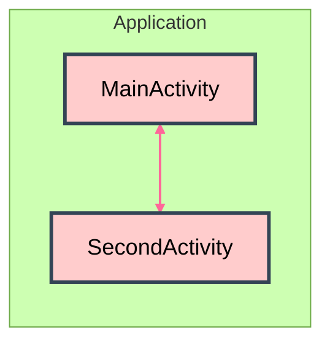
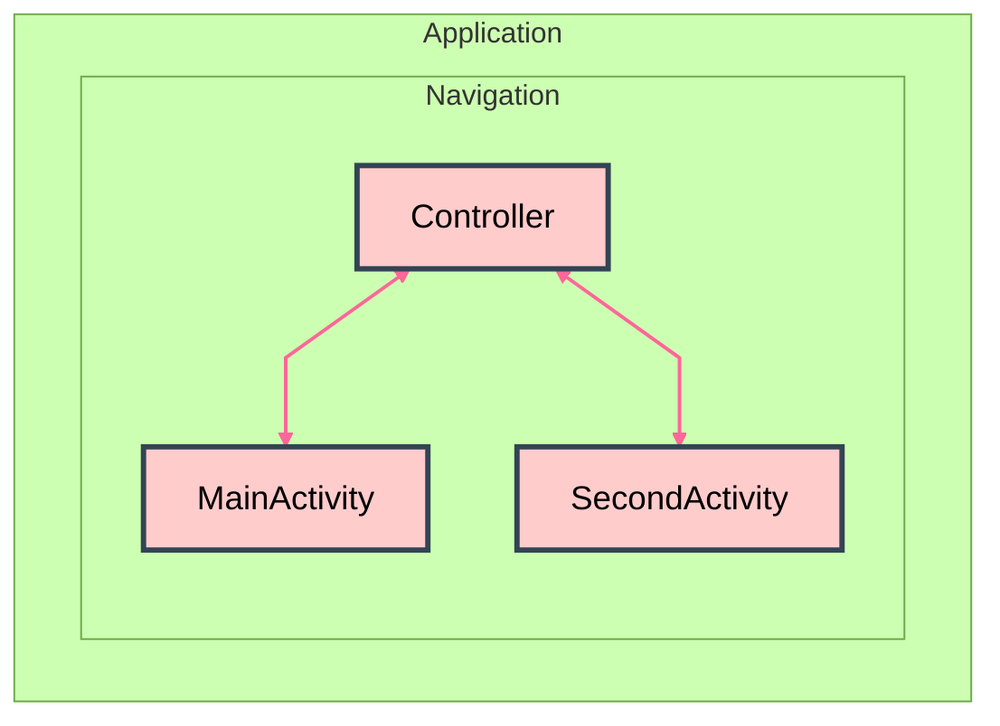
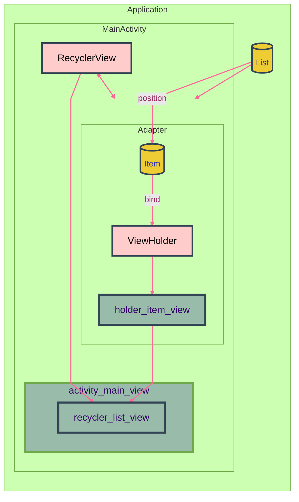
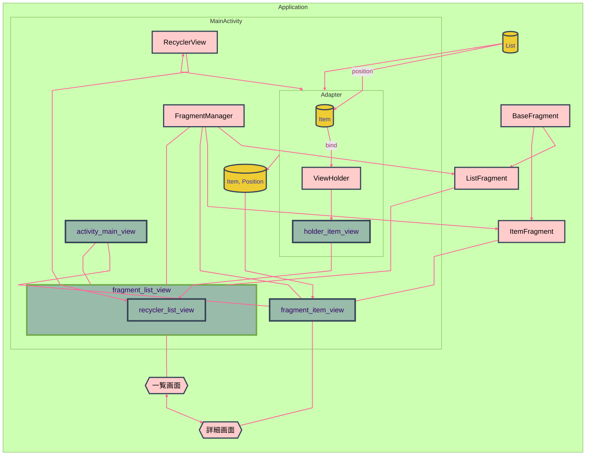

# Activity, Fragment, RecyclerView

について、とりあえずメモ

---

# 🌒️ 序

Android app 作る tutorial とか見ると、まずは、2つ程度の activity を用意して、その間で画面遷移するサンプルコードが出てくる。でもこれ、割と過去の遺物らしい。今（といってももう6年ほど前から）は single activity とか言って、activity をたくさん作らないようにしようよ、って流れができているみたい。

なんで？っていうと、初心者が最初に躓くのが、 activity 間を結びつけるコードを書くのが難しいから。実際これはかなり綱渡りなコードになる。

1. Android app には main() みたいな唯一の起動ポイントが無く、どの activity から起動しても良い
2. OS は、メモリ逼迫などの必要に応じていつでも、任意の activity を消せる
3. したがって画面を呼び出したとき、既存のものを再利用する場合と新規起動する場合とがある

このあたりの仕様により、activity の instance をどこかで静的に保持することができず、this 渡してコールバックさせればいいじゃん、みたいなコードを書くと IDE に怒られる。

どうやら私が初心者だから難しいと思っていたのではなく、みんなが難しいと思っていたみたいで、流れが single activity とか navigation とかいう方向に行っているようだ。でもそういう新しい流れに沿ったコードが tutorial とか初心者向けサンプルコードには出てこないのが壁になっている。

---

# 🌕️ 破

## 伝統的な multi activity

サンプルコードやテンプレートはだいたいこれ。

簡単に見えるけど、 Activity 間のやりとりが割とハマりどころ。

## navigation に任せる

Application と Activity の間に、Navigation という層を入れて、そこに連携を任せる方法。Interface とか Kotlin Object とかを経由すると連携できるっていう解決策を Framework として提供してきた感じか。

## single activity なら連携が発生しない?

複数作るから連携が難しいんだ。。。という、そもそもな発想転換。画面を切り替えるのではなく、Factory パターンで中身を入れ替えていく。

### RecyclerView で list の item 表示の view を動的に作る

### Fragment で、画面を入れ替える

一覧画面で List のどれかをタップしたときに Item の詳細画面を出す、とかを典型的なサンプルだと2つの Activity を使う。これを1つの Activity で実現するために、一覧画面と詳細画面を動的に入れ替える。これが Fragment だ。

かなりすっきりしたように見えるものの、これでも実は、 Item, Position みたいな情報を MainActivity に引き渡すところで下手をすると闇に落ちる。

やってないので想像だが、そこの部分まですっきりさせたければ、さらに Navigation とかを投入するのか。。。

# 🌖️ 急

## 参考資料

### Navigation

[Navigation | App architecture | Android Developers](https://developer.android.com/guide/navigation/)

[[Android] Navigationの基礎の基礎 - Qiita](https://qiita.com/t_nana/items/d3f71faefa4ec69c0ca9)

### RecyclerView

[Create dynamic lists with RecyclerView | Views | Android Developers](https://developer.android.com/develop/ui/views/layout/recyclerview)

[【Android】世界一わかりやすいRecyclerViewの実装](https://zenn.dev/squ4t4r014/articles/a2cde436f4c099)

[android Kotlin RecyclerViewの使い方 - Qiita](https://qiita.com/soutominamimura/items/47a48e4e6e1aff3d3396)

[Simple Android RecyclerView example](https://stackoverflow.com/questions/40584424/simple-android-recyclerview-example)

### Fragment

[Fragments | App architecture | Android Developers](https://developer.android.com/guide/fragments)

[Single activity: Why, when, and how (Android Dev Summit '18)](https://youtu.be/2k8x8V77CrU?si=1XpmSM9zAmflmjf0)

[Fragments: Past, present, and future (Android Dev Summit '19)](https://youtu.be/RS1IACnZLy4?si=pgcJZdnmEe4Qiu1R)

