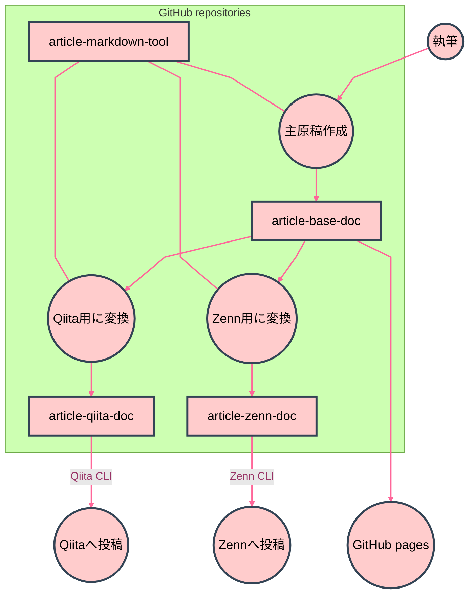
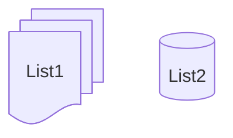

# Zenn, Qiita に GitHub から記事公開する — 模索編

手動で投稿してみて、自動化を考える。

---

# 🌒️ 序

前回と前々回の投稿は、自動化を前提にCLIの操作を学びつつ、問題点を整理しつつ行った。それを踏まえ、自動化に必要となるものを整理する。

- 前回投稿: GitHub Fine-grained Personal Access Token を使う
  - https://zenn.dev/nosaki/articles/e0d673e9dbfbb2
  - https://qiita.com/nyosaki/items/70980d0d2450b6cb7859
- 前々回投稿: Activity, Fragment, RecyclerView について、とりあえずメモ
  - https://zenn.dev/nosaki/articles/435d6ae8e8ee56
  - https://qiita.com/nyosaki/items/381b3255ea2c8af21f1f

# 🌕️ 破

## grand architecture

- 主原稿をアップ・編集するレポジトリを用意する
- 主原稿は GitHub Flavored Markdown で書く
- Zenn と Qiita 用にそれぞれのレポジトリを用意し、主原稿から変換する
- Zenn と Qiita は、それぞれのレポジトリで CLI を動かして投稿する
- 必要なツールを置くレポジトリを別途、用意する



## article-base-doc

主原稿用レポジトリ
https://github.com/nyosak/article-base-doc

```bash
article-base-doc$ tree 
.
├── docs
│   ├── a
│   │   ├── 70227_recycler_view.md
│   │   ├── 70302_github_token.md
│   │   └── 70525_publish_zenn_qiita.md
│   ├── media
│   │   ├── 70302_github_token_git_auth_browser.png
│   │   ├── 70302_github_token_git_auth_switch.png
│   │   └── 70302_github_token_git_auth_token.png
│   └── meta
│       ├── 70227_recycler_view.yaml
│       ├── 70302_github_token.yaml
│       └── 70525_publish_zenn_qiita.yaml
└── README.md

```

- docs フォルダを作り、GitHub pages と連携させる
- a, meta, media の 3つのフォルダを組にする
  - a: 文書
  - meta: 文書情報
  - media: 画像等
- 将来は、b, metb, medib 等に切り替えていくことでアーカイブを切り離す
- ファイル名は、 `日付_簡易名` を記事ごとの key として使う
  - 日付は、令和歴で、YMMDD 形式とする
  - これは出版日ではなく、初期ファイル作成日
    - ちなみにこの原稿は、 70525_publish_zenn_qiita.md に書き込み中
  - 文書と文書情報は、 key に `.md` および `.yaml` をつけてファイル名とする
  - 画像等は、 key の後ろに画像ファイル名を続ける
- 文書情報は、 yaml もどき
  - 1階層のみとする
  - 要素は string のみとする
  - 単なる `key: value` なテキスト
    - 配列を yaml 要素として書かずに、暗黙的に解釈可能なテキストにしておくだけで、かなり簡単になる
  - 格納する内容は、 Zenn, Qiita で必要な文書情報の和集合とする
- main ブランチへの更新で、 GitHub pages を自動更新する
  - 画像へのリンクは、 GitHub pages を使う
- README.md にそれぞれの記事へのリンクを置く

```yaml
title: Activity, Fragment, RecyclerView について、とりあえずメモ
tags: Android Activity Fragment RecyclerView
type: tech
emoji: 🐚

```

## article-zenn-doc

Zenn 投稿用レポジトリ
https://github.com/nyosak/article-zenn-doc

```bash
article-zenn-doc$ tree -L 2
.
├── articles
│   ├── 435d6ae8e8ee56.md
│   └── e0d673e9dbfbb2.md
├── books
├── node_modules
│   └── zenn-cli
├── package.json
├── package-lock.json
└── README.md

```

- Zenn CLI は手順書にしたがって入れる
  - https://zenn.dev/zenn/articles/connect-to-github
  - https://zenn.dev/zenn/articles/install-zenn-cli
- 記事は articles 配下に置かれる
- ファイル名は Zenn 上の id を使っており、 Zenn CLI により採番されている
  - Zenn CLI に初期ファイルを作成させてから、中身に主原稿を流し込むという手順になる
- Zenn CLI にてプレビューと投稿管理が可能
- main ブランチへの更新で Zenn への投稿が走る
- Zenn の記事書式は、先頭に文書情報が入り、それに本文の markdown が続く

```bash
article-zenn-doc$ head articles/435d6ae8e8ee56.md 
---
title: "Activity, Fragment, RecyclerView について、とりあえずメモ"
topics: ["Android", "Activity", "Fragment", "RecyclerView"]
type: "tech"
emoji: "🐚"
published: true
---
# Activity, Fragment, RecyclerView

について、とりあえずメモ

```

## article-qiita-doc

Qiita 投稿用レポジトリ
https://github.com/nyosak/article-qiita-doc

```bash
article-qiita-doc$ tree -I node_modules
.
├── package.json
├── package-lock.json
├── public
│   ├── github_token.md
│   └── recycler_view.md
├── qiita.config.json
└── README.md

```

- Qiita CLI は手順書にしたがって入れる
  - https://qiita.com/Qiita/items/32c79014509987541130
- 記事は public 配下に置かれる
- ファイル名はこちらで指定できるので、主原稿の key を使う
  - 過去2つは日付部分を除外して作ったのだが、これだと将来、名前が被る可能性があるので、やはり日付を入れるのが良い
- Qiita CLI にてプレビューと投稿管理が可能
- main ブランチへの更新で Qiita への投稿が走る
- Qiita の記事書式は、先頭に文書情報が入り、それに本文の markdown が続く

```bash
article-qiita-doc$ head -n 17 public/recycler_view.md 
---
title: 'Activity, Fragment, RecyclerView について、とりあえずメモ'
tags:
  - Android
  - Activity
  - Fragment
  - RecyclerView
private: false
updated_at: '2025-02-28T09:37:20+09:00'
id: 381b3255ea2c8af21f1f
organization_url_name: null
slide: false
ignorePublish: false
---
# Activity, Fragment, RecyclerView

について、とりあえずメモ

```

## article-markdown-tool

ツール用レポジトリ
https://github.com/nyosak/article-markdown-tool

- 4つのレポジトリを同一端末に clone して、ローカル上でツールを動かす
- clone したローカルディレクトリ名がレポジトリ名と一致する前提
- 執筆、プレビュー、修正などの手作業が随所に入るので、全自動ではなく、部分自動化の小さなスクリプトを多数作る
  - 考える必要のない作業を自動化する

## md to html

GitHub pages には、md を html に自動変換する機能が無いので（Jekyll は使わない前提）、デプロイ時に変換を組み込む必要がある。これは Zenn, Qiita への投稿には関係ないので、急ぐ必要はない。当面は画像ファイルがデプロイできれば良い。

README.md にリンクを貼るのも同様で、そのうちできれば良い機能。

## ブランチ

記事の key を、当該記事を扱うときのブランチ名とする。

## markdown 記法の差異

minimalist 対応でいく。

もともと、私が markdown 使うときに minimalist で、あまり煩雑な書式指定をしない。で、実際に投稿してみて、自分が使う範囲ではごくわずかしか問題が発生しないとわかった。発生した問題についても、「それを使わない」ことで回避する方針にし、まずは `変換不要` というところから始める。

## 把握した差異

### nested ordered list

1. こんな
    1. 感じで
    1. 入れ子に
1. なった
1. 順序付きリスト

GitHub, Nortion では親が 1,2,3 に対し、子が a,b などと種類の違う序数になる。一方で、 Zenn, Qiita では、親子とも数字の序数になる。これは、前者が html ol の書式設定に任せており browser で序数を生成しているのに対し、後者が自前で css の class を決めで親子ともども同じ class 指定の固定書式を設定しているという、実装方式の違いによる。

好みによるだろうが、見づらい。

ordered list は入れ子にしない、という対応にする。どうしても入れ子にしたければ、子要素は unordered list にする。

1. こんな
    - 感じで
    - 入れ子を順序なしにした
1. 順序付きリスト

### mermaid

[Expanded Node Shapes](https://mermaid.js.org/syntax/flowchart.html#expanded-node-shapes-in-mermaid-flowcharts-v11-3-0) に Zenn が対応していない。おそらくバージョンが古いのだと思われる。

```
List1@{ shape: documents }
```

この拡張は避けて、次のように書くことにする。

```
List2[(List2)]
```

このエラーが消えたら、対応したということか。



## Node.js

> Zenn CLIを使うにはNode.js 14以上が必要です。
> Qiita CLI を使うには Node.js 18.18.0 以上が必要です。

Ubuntu 22.04 だと、標準で手に入るバージョンは 12.22.9 とかなり古い。
素直に公式から最新のを入れて、 Zenn, Qiita の両方に対応する。

[Install Node.js 22.x LTS](https://deb.nodesource.com/)

素の Ubuntu だと curl なんかが意外と入ってなかったり、vim も small version で低機能版だったりするので、こういう機会にちゃんと入れておく。

```bash
sudo apt install curl
sudo apt install vim
```

## Zenn CLI

### GitHub連携

Zenn の管理画面、 GitHub からのデプロイ(GitHub連携)で、リポジトリ設定を行う。
設定開始すると、 GitHub 画面に遷移し、連携するレポジトリへの read 権限を付与するという流れになる。

レポジトリの GitHub Apps のところに、 Zenn Connect が追加される。そこの configure ボタンを押せば、さきほどの設定画面が再び出てきて、設定を削除することもできる。 Zenn の画面からも連携解除できるようだ。

### インストール

```bash
article-zenn-doc$ npm init --yes
Wrote to article-zenn-doc/package.json:

{
  "name": "article-zenn-doc",
  "version": "1.0.0",
  "description": "",
  "main": "index.js",
  "scripts": {
    "test": "echo \"Error: no test specified\" && exit 1"
  },
  "keywords": [],
  "author": "",
  "license": "ISC"
}

article-zenn-doc$ npm install zenn-cli

added 1 package, and audited 2 packages in 3s

found 0 vulnerabilities

```

### 初回設定

```bash
article-zenn-doc$ npx zenn init
Generating README.md skipped.

  🎉  Done!
  早速コンテンツを作成しましょう

  👇  新しい記事を作成する
  $ npx zenn new:article

  👇  新しい本を作成する
  $ npx zenn new:book

  👇  投稿をプレビューする
  $ npx zenn preview

```

README.md が既に存在していたので、作成がスキップされた。影響はないだろう。

原稿配置用の、 articles, books というディレクトリがこの時点で設置されている。

```bash
article-zenn-doc$ ls -a articles/
.  ..  .keep
article-zenn-doc$ ls -a books/
.  ..  .keep

```

このように、 .keep ファイルを配置してレポジトリに登録している。

main ブランチに push するとデプロイが走り、Zenn管理画面の GitHub 連携が更新される。

> 最近のデプロイ
> 
> デプロイ成功
> 更新されたファイルはありません

### 原稿作成

```bash
article-zenn-doc$ npx zenn new:article
created: articles/435d6ae8e8ee56.md

article-zenn-doc$ cat articles/435d6ae8e8ee56.md 
---
title: ""
emoji: "👏"
type: "tech" # tech: 技術記事 / idea: アイデア
topics: []
published: false
---

```

このようにデフォルトファイルが作成される。ちなみに emoji はランダムに変わるようだ。
ファイル名を指定する必要はなく、上記のようにランダムな名前で生成される。

`--slug` というオプションでファイル名指定可能なようだが、この名称には自分の記事だけでなく、Zenn の記事全体でユニークという無茶な制限があるので、自動投稿での指定は避けた方が無難だろう。使用済みだったらランダム生成に自動で切り替わってくれる方式なら良いのだが。

```bash
article-zenn-doc$ npx zenn new:article --slug what-is-slug
created: articles/what-is-slug.md

```
https://zenn.dev/zenn/articles/what-is-slug

うーむ。既存の slug を指定してもエラーも出ず、ローカル文書を作ってしまう仕様なのか。publish でエラーになって初めて気づくってのは困るな。

その一方で、今のランダム文字列だと、投稿が増えてくると、どの記事が base と紐付いているのか探すのが困難になってくると思われる。

> slugは半角英小文字（a-z）、半角数字（0-9）、ハイフン（-）、アンダースコア（_）の12〜50字の組み合わせにする必要があります。

`key-random` にするか。 `key` に令和が入っている時点でほぼ他人とは被らないだろうし。ハイフン以降を切り捨てたら `key` になるから探せるようになる。5桁の乱数を入れれば、12文字以上も確実に達成できるだろう。publish で万一エラーになった場合、この仕様ならおそらく、 `git mv` でファイル名の乱数部分を変更したのを push すればおそらく良いはず。

article-base-doc の記事の文書情報から残りの項目を更新し、文書ファイルの中身を末尾に追加すれば良い。

使用する文書情報項目は、次のとおり。

```yaml
title: Activity, Fragment, RecyclerView について、とりあえずメモ
tags: Android Activity Fragment RecyclerView
type: tech
emoji: 🐚

```

title, emoji, type はそのまま持ってくる。 tags を topics に配列として変換。

> topics（記事に関連する言語や技術）を配列で指定してください。例）["react", "javascript"]

published は、過去形なので一瞬ステータスを示すように見えるが、実は未来の制御フラグ。これを true にしてから push すると投稿される。

published_at とかで日時指定投稿もできるようだ。

https://zenn.dev/zenn/articles/zenn-cli-guide#%E6%97%A5%E6%99%82%E3%82%92%E6%8C%87%E5%AE%9A%E3%81%97%E3%81%A6%E8%A8%98%E4%BA%8B%E3%82%92%E5%85%AC%E9%96%8B%E3%81%99%E3%82%8B%EF%BC%88%E5%85%AC%E9%96%8B%E4%BA%88%E7%B4%84%E3%81%99%E3%82%8B%EF%BC%89


### プレビュー

```bash
article-zenn-doc$ npx zenn preview
👀 Preview: http://localhost:8000

```

Qiita と違い、ブラウザが自動起動しないので、上記 URL を自分で開く。

このあたりで制御しているのか？

```bash
article-zenn-doc$ grep localhost node_modules/zenn-cli/package.json 
    "dev:client": "wait-on http://localhost:8000 && vite",

```

### 投稿

レポジトリへの read 権限を付与した app を登録しているので、それが Zenn への投稿を行うものと思われる。ステータスは Zenn 側で見るしかないようだ。

> 記事を zenn.dev 上で公開するには`published`オプションが`true`になっていることを確認したうえで、ファイルをコミットし、Zenn と連携されている GitHub リポジトリにプッシュします。

> なおコミットメッセージに`[ci skip]`もしくは`[skip ci]`が含まれていると Zenn でのデプロイがスキップされます。

Qiita と違い、投稿によってファイルが変更されることは無い。
id 的なものは最初に作っているし、デプロイ日時のような流動的な情報も持っていないので。

### アップデート

このような表示が出たら、アップデートする。

```bash
article-zenn-doc$ npx zenn preview

   ╭───────────────────────────────────────────────────────────────╮
   │                                                               │
   │   新しいバージョンがリリースされています: 0.1.158 → 0.1.159   │
   │   npm install zenn-cli@latest で更新してください              │
   │                                                               │
   ╰───────────────────────────────────────────────────────────────╯

👀 Preview: http://localhost:8000

```

## Qiita CLI

### インストール

```bash
article-qiita-doc$ npm install @qiita/qiita-cli --save-dev

added 132 packages in 20s

38 packages are looking for funding
  run `npm fund` for details
npm notice
npm notice New major version of npm available! 10.8.2 -> 11.1.0
npm notice Changelog: https://github.com/npm/cli/releases/tag/v11.1.0
npm notice To update run: npm install -g npm@11.1.0
npm notice

article-qiita-doc$ npx qiita version
1.6.1

```

### 初回設定

```bash
article-qiita-doc$ npx qiita init
設定ファイルを生成します。

  Creating article-qiita-doc/.github/workflows/publish.yml
     Created!

  Creating article-qiita-doc/.gitignore
     Created!

  Creating article-qiita-doc/qiita.config.json
     Created!

Success! ✨

次のステップ:

  1. トークンを作成してログインをしてください。
    npx qiita login

  2. 記事のプレビューができるようになります。
    npx qiita preview

```

トークンというのは、 Qiita の設定画面で発行する、qiita-cli 用の個人用アクセストークンだ。これで認証して GitHub からの投稿が行われる。発行したトークンは `アプリケーション` の項で確認できる。上記のログイン操作により、 GitHub の Actions secrets and variables の Repository secrets の項に `QIITA_TOKEN` が格納される。

```bash
Hi !

ログインが完了しました 🎉
以下のコマンドを使って執筆を始めましょう！

🚀 コンテンツをブラウザでプレビューする
  npx qiita preview

🚀 新しい記事を追加する
  npx qiita new (記事のファイルのベース名)

🚀 記事を投稿、更新する
  npx qiita publish (記事のファイルのベース名)

💁 コマンドのヘルプを確認する
  npx qiita help

```

原稿格納用のディレクトリを作っておく。

```bash
article-qiita-doc$ mkdir public
```

### 原稿作成

```bash
article-qiita-doc$ npx qiita new recycler_view
created: recycler_view.md

article-qiita-doc$ cat public/recycler_view.md 
---
title: recycler_view
tags:
  - ''
private: false
updated_at: ''
id: null
organization_url_name: null
slide: false
ignorePublish: false
---
# new article body

```

指定するのは `記事ファイルのベース名` だけで、それがファイル名と title に使われる。残りの項目はデフォルトの状態になっている。

article-base-doc の記事の文書情報からこれらを更新し、文書ファイルの中身を末尾の # new article body 行と入れ替えれば良い。

使用する文書情報項目は、次のとおり。

```yaml
title: Activity, Fragment, RecyclerView について、とりあえずメモ
tags: Android Activity Fragment RecyclerView
```

title はそのまま。 tags を yaml 形式の配列に変換すればよい。

### プレビュー

```bash
article-qiita-doc$ npx qiita preview
Preview: http://127.0.0.1:8888

```

プレビューといっても、マニュアルのホームページが開くだけだ。操作するのは左側のナビゲーションバーを開いて、見たい記事を選ぶ。

ちなみに、このローカルポートなんかは、次のファイルで制御しているっぽい。

```bash
article-qiita-doc$ cat qiita.config.json 
{
  "includePrivate": false,
  "host": "localhost",
  "port": 8888
}

```

### 投稿

投稿の仕組みは GitHub Workflow だ。レポジトリの Actions のところで実行状況が確認できる。
`main`, `master` ブランチの更新で起動する。


```yaml
article-qiita-doc$ cat .github/workflows/publish.yml 
# Please set 'QIITA_TOKEN' secret to your repository
name: Publish articles

on:
  push:
    branches:
      - main
      - master
  workflow_dispatch:

permissions:
  contents: write

concurrency:
  group: ${{ github.workflow }}-${{ github.ref }}
  cancel-in-progress: false

jobs:
  publish_articles:
    runs-on: ubuntu-latest
    timeout-minutes: 5
    steps:
      - uses: actions/checkout@v4
        with:
          fetch-depth: 0
      - uses: increments/qiita-cli/actions/publish@v1
        with:
          qiita-token: ${{ secrets.QIITA_TOKEN }}
          root: "."

```

投稿により、リモートの main ブランチに変更が加わる。

```diff
article-qiita-doc$ git diff main origin/main
diff --git a/public/recycler_view.md b/public/recycler_view.md
index e74979e..825f9c8 100644
--- a/public/recycler_view.md
+++ b/public/recycler_view.md
@@ -1,13 +1,13 @@
 ---
-title: Activity, Fragment, RecyclerView について、とりあえずメモ
+title: 'Activity, Fragment, RecyclerView について、とりあえずメモ'
 tags:
-  - 'Android'
-  - 'Activity'
-  - 'Fragment'
-  - 'RecyclerView'
+  - Android
+  - Activity
+  - Fragment
+  - RecyclerView
 private: false
-updated_at: ''
-id: null
+updated_at: '2025-02-28T09:37:20+09:00'
+id: 381b3255ea2c8af21f1f
 organization_url_name: null
 slide: false
 ignorePublish: false

```

投稿後に、 git pull してローカルを同期させておくのが良い。

ちなみに、 GitHub Actions が正常終了したときは何の通知も来ないが、エラーが出た場合にはエラーを通知するメールが飛んでくる。

### アップデート

このような表示が出たら、アップデートする。

```bash
article-qiita-doc$ npx qiita preview

   ╭─────────────────────────────────────────────────────────────────╮
   │                                                                 │
   │   新しいバージョンがあります!  1.6.1 -> 1.6.2                   │
   │   npm install @qiita/qiita-cli@latest でアップデートできます!   │
   │                                                                 │
   ╰─────────────────────────────────────────────────────────────────╯

Preview: http://127.0.0.1:8888

```

## GitHub pages

画像アップロードと、それに伴うリンクの変更は、自動化が難しい部分だ。そこで、 GitHub pages を共通の画像書庫として使い、固定リンクで使い回せるようにする。

https://nyosak.github.io/article-base-doc/media/70302_github_token_git_auth_browser.png

このリンク先は自分がアップしたファイルのとおりなので、投稿前に決めておくことができる。GitHub レポジトリの raw ファイル参照でも良いのだが、上記の方が URL としてはスマートだ。

レポジトリの Settings -> Pages で設定できる。 public レポジトリであれば無料で設置できる。

- https://nyosak.github.io/article-base-doc/
- Deploy from a branch
- branch: main
- directory: /docs

main ブランチが更新されると、 docs 配下がサイト側にデプロイされる。
標準のデプロイは単純なコピーに過ぎず、 md ファイルを html ファイルに変換してはくれないので、現在、上記 URL には index.html が無く、 404 error になる。直リンクでのみ見れる状態だ。

いずれ、 index.html を配置して、手軽に見れるようにしたい。


## 主原稿をどこで書くか？

当初は Notion で書いてみたのだが、なんだかんだで今はローカルのテキストエディタに戻っている。理由は次のとおりだ。

- Notion から記事をレポジトリ等に持っていくのが割と手間
  - いちいち export などやってられない
  - Ctrl-A, Ctrl-C だと手作業の不安定さが残る
- 同期の待ち時間がたるい
  - ちょっとした修正のために、ゼロからの起動だとかなり待たないと書けない
- 後から書式変更するときに、いちいちクリックして選ぶよりも直接編集したい
- 完全オフラインの方が圧倒的に早い

まあ、この原稿に関しては、個人で全部書き上げるし、誰かのレビューを受けるわけでもないし、で Notion の得意としている機能がまったく不要だというのが大きな要素かもしれない。

## 過去記事をどう参照する？

共通原稿にした際に発生するのが（画像リンクと似ているが）、過去記事参照のリンク先をどうするかという問題だ。デプロイ時に切り替えてくれると、それはスマートかもしれないが、私は不要だと思っている。同じ内容の原稿を Zenn と Qiita の両方に投稿します！と宣言してやっているのだから、リンク先は両方を併記するのが良いだろう。

他社サイトへのリンクは流出につながるとして嫌がる人もいるが、私は他社へのリンクこそ web の本質で、インターネットを発展させてきた原動力だと思っている。


# 🌖️ 急

## 参考資料

### Zenn

- [アカウントにGitHubリポジトリを連携してZennのコンテンツを管理する](https://zenn.dev/zenn/articles/connect-to-github)
- [Zenn CLIで記事・本を管理する方法](https://zenn.dev/zenn/articles/zenn-cli-guide)
- [ZennのMarkdown記法一覧](https://zenn.dev/zenn/articles/markdown-guide)
- [【チートシート】Markdown記法一覧](https://zenn.dev/yadonn/articles/94f12b3c9dcbc6)
- [Zenn CLIをインストールする](https://zenn.dev/zenn/articles/install-zenn-cli)
- [Zenn完全に理解した - Qiita](https://qiita.com/unsoluble_sugar/items/558a11b455d042d648d6)
- [GitHubリポジトリ連携で画像をアップロードする方法](https://zenn.dev/zenn/articles/deploy-github-images)

### Qiita

- [Qiitaの記事をGitHubリポジトリで管理する方法 - Qiita](https://qiita.com/Qiita/items/32c79014509987541130)
- [Markdown記法 チートシート - Qiita](https://qiita.com/Qiita/items/c686397e4a0f4f11683d)
- [【Rails】Qiita::Markdownをインストールして使ってみる](https://zenn.dev/noraworld/articles/installation-of-qiita-markdown)
- [画像アップロード機能をリリースしました - Qiita Blog](https://blog.qiita.com/50993800271-2/)

### 連携とか比較とか

- [Zenn vs Qiita 書きやすさ比較](https://zenn.dev/hilltop/articles/diff-zenn-qiita)
- [zenn, Qiita, note, Notion, GitHubの表記まとめ](https://zenn.dev/aokikenichi/articles/c5692f98deeda4)
- [Notionからmarkdownに変換するOSSを公開しました（Zennも対応）](https://zenn.dev/smartcamp/articles/4b3e05623bf11e)
- [Zenn と Qiita の記事を GitHub でまとめて管理する方法](https://zenn.dev/shogo_wada_pro/articles/35db506b92caae)
- [Zenn と Qiita の記事を GitHub でまとめて管理する方法 - Qiita](https://qiita.com/shogo_wada_pro/items/c41d4a6a9b2b2394e407)
- [Markdown から WordPress, Qiita, Note, Zenn へ爆速クロス投稿！OASIS v0.7.0 の使い方](https://zenn.dev/sunwood_ai_labs/articles/markdown-to-wordpress-qiita-note-zenn-quick-cros)

### その他

- [Creating a GitHub Pages site - GitHub Docs](https://docs.github.com/en/pages/getting-started-with-github-pages/creating-a-github-pages-site)
- [Nodesource Node.js DEB](https://deb.nodesource.com/)
- [Ubuntu 22.04にNode.jsとNPMをインストール・アンインストールする方法 - Qiita](https://qiita.com/blue_islands/items/510c7ab93e6a9e415645)
- [UbuntuのVim入力がおかしい場合は低機能版が原因かも - Qiita](https://qiita.com/waokitsune/items/4f4f9808c0a7b9e1c698)
- [TOML: Tom's Obvious Minimal Language](https://toml.io/en/)
- [TOMLは人に優しい設定ファイル言語 - Qiita](https://qiita.com/kazsharp/items/eab5675da41cd1eb7159)
- [Markdown ordered lists github and github pages · community · Discussion #114405](https://github.com/orgs/community/discussions/114405)
- [How to avoid hyperlink creation when writing down URIs in markdown?](https://stackoverflow.com/questions/20492603/how-to-avoid-hyperlink-creation-when-writing-down-uris-in-markdown)
