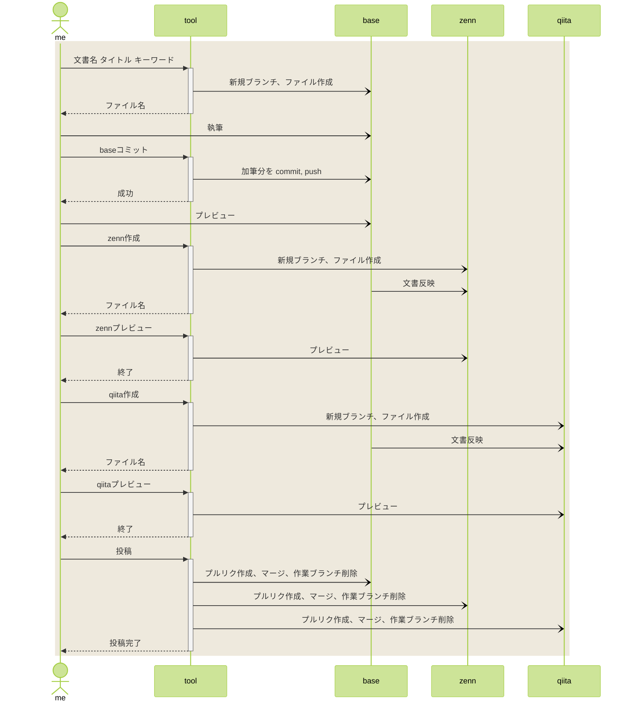
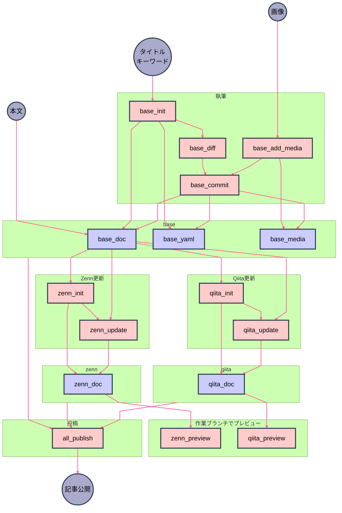
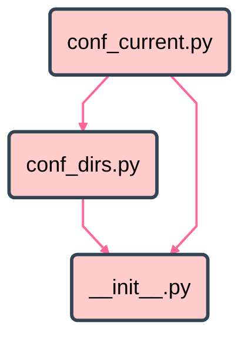
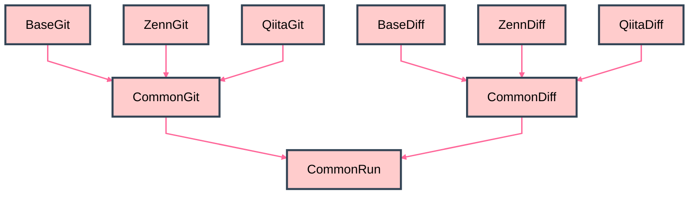
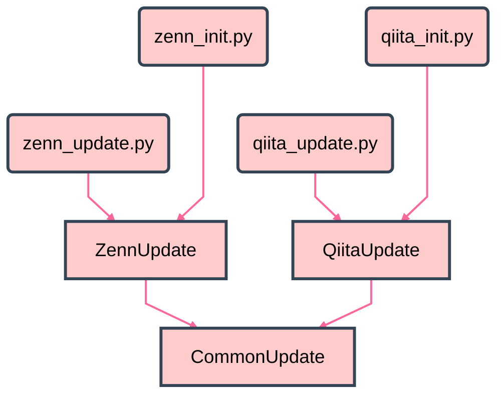
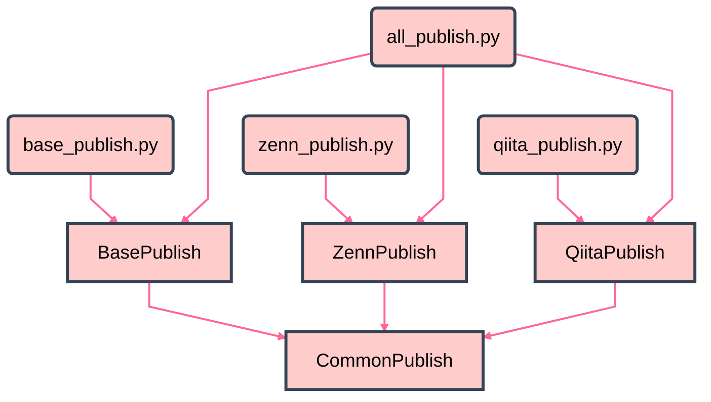
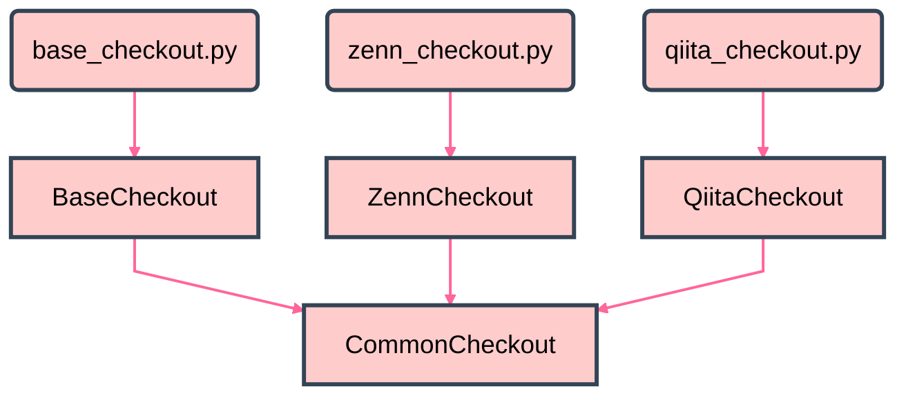

# Zenn, Qiita に GitHub から記事公開する — 実装編

前回の投稿で考えた方針に沿って自動化する。

---

# 🌒️ 序

前回の模索編でまとめた方針（ [Zenn](https://zenn.dev/nosaki/articles/70525_publish_zenn_qiita-82734), [Qiita](https://qiita.com/nyosaki/items/d25cdf9aa6ee15c19c62) ）で実装してみる。言語は Python を使った。理由は「そこにあったから」。 Ubuntu だと簡易版の Python3 が最初から入っている。フル版を入れなくても良い程度のものしか作らないだろうから、あるものを使うことにした。

# 🌕️ 破

## 作業の流れ



## 記憶

小さなスクリプトを粗結合で動かすために、作業内容を覚えておく記憶領域が欲しい。作業中のファイル名などをすべてのスクリプトに引数として与えて起動するのでは、手軽さが失われるから。

tool のレポジトリに tmp フォルダを作り、 .gitignore しておく。
そこに、 current_* というファイルを作り、簡単な key value store として機能させる。

```bash
article-markdown-tool$ ls tmp
current_key  current_name  current_now  current_series  current_test

article-markdown-tool$ publish/show_current.sh 
- current_key: 70530_publish_zenn_qiita
- current_name: publish_zenn_qiita
- current_now: 70530
- current_series: a
- current_test: test_value2

```

## GitHub CLI

プルリクの作成とマージをスクリプトで行いたい。通常の git コマンドではできないので GitHub CLI を導入する。ローカルで main にマージして push するのではなく、プルリクを作りたい。マージについて、自動で行う場合と、人が確認してから手で行いたい場合の両方に対応したい。人が行うときには、プルリクができていると操作が楽。

### インストール

https://github.com/cli/cli/blob/trunk/docs/install_linux.md

Ubuntu Linux にインストールするには、こちらの手順に従えばよい。

### token

```bash
gh auth login
```

コマンドを実行すると GitHub ログインに使う personal access token の入力が求められる。

> The minimum required scopes are 'repo', 'read:org', 'workflow'.

ということなので、 token のアクセス権限に workflow も追加しておく。また、今回はプルリク作成が目的なので、 pull request の読み書き権限も追加しておく。

### gh pr

```bash
$ gh pr --help
Work with GitHub pull requests.

USAGE
  gh pr <command> [flags]

GENERAL COMMANDS
  create:        Create a pull request
  list:          List pull requests in a repository
  status:        Show status of relevant pull requests

TARGETED COMMANDS
  checkout:      Check out a pull request in git
  checks:        Show CI status for a single pull request
  close:         Close a pull request
  comment:       Add a comment to a pull request
  diff:          View changes in a pull request
  edit:          Edit a pull request
  lock:          Lock pull request conversation
  merge:         Merge a pull request
  ready:         Mark a pull request as ready for review
  reopen:        Reopen a pull request
  review:        Add a review to a pull request
  unlock:        Unlock pull request conversation
  update-branch: Update a pull request branch
  view:          View a pull request

FLAGS
  -R, --repo [HOST/]OWNER/REPO   Select another repository using the [HOST/]OWNER/REPO format

INHERITED FLAGS
  --help   Show help for command

ARGUMENTS
  A pull request can be supplied as argument in any of the following formats:
  - by number, e.g. "123";
  - by URL, e.g. "https://github.com/OWNER/REPO/pull/123"; or
  - by the name of its head branch, e.g. "patch-1" or "OWNER:patch-1".

EXAMPLES
  $ gh pr checkout 353
  $ gh pr create --fill
  $ gh pr view --web

LEARN MORE
  Use `gh <command> <subcommand> --help` for more information about a command.
  Read the manual at https://cli.github.com/manual
  Learn about exit codes using `gh help exit-codes`
  Learn about accessibility experiences using `gh help accessibility`

```

```bash
article-base-doc$ gh pr status

Relevant pull requests in nyosak/article-base-doc

Current branch
  There is no pull request associated with [70530_publish_zenn_qiita]

Created by you
  You have no open pull requests

Requesting a code review from you
  You have no pull requests to review

```

画面出力が、通常の git コマンド同様に、見た目重視で扱いづらいと思ったが、実は json 出力できるのだった。

```bash
$ gh pr status --help
Show status of relevant pull requests.

The status shows a summary of pull requests that includes information such as
pull request number, title, CI checks, reviews, etc.

To see more details of CI checks, run `gh pr checks`.

For more information about output formatting flags, see `gh help formatting`.

USAGE
  gh pr status [flags]

FLAGS
  -c, --conflict-status   Display the merge conflict status of each pull request
  -q, --jq expression     Filter JSON output using a jq expression
      --json fields       Output JSON with the specified fields
  -t, --template string   Format JSON output using a Go template; see "gh help formatting"

INHERITED FLAGS
      --help                     Show help for command
  -R, --repo [HOST/]OWNER/REPO   Select another repository using the [HOST/]OWNER/REPO format

JSON FIELDS
  additions, assignees, author, autoMergeRequest, baseRefName, baseRefOid, body,
  changedFiles, closed, closedAt, closingIssuesReferences, comments, commits,
  createdAt, deletions, files, fullDatabaseId, headRefName, headRefOid,
  headRepository, headRepositoryOwner, id, isCrossRepository, isDraft, labels,
  latestReviews, maintainerCanModify, mergeCommit, mergeStateStatus, mergeable,
  mergedAt, mergedBy, milestone, number, potentialMergeCommit, projectCards,
  projectItems, reactionGroups, reviewDecision, reviewRequests, reviews, state,
  statusCheckRollup, title, updatedAt, url

LEARN MORE
  Use `gh <command> <subcommand> --help` for more information about a command.
  Read the manual at https://cli.github.com/manual
  Learn about exit codes using `gh help exit-codes`
  Learn about accessibility experiences using `gh help accessibility`

```

```bash
article-zenn-doc$ gh pr status --jq '{currentBranch}' --json id,url
{
  "currentBranch": null
}

article-base-doc$ gh pr status --jq '{currentBranch}' --json id,url,baseRefName
{
  "currentBranch": {
    "baseRefName": "hoge",
    "id": "PR_kwDOOAVFLM6XfQFh",
    "url": "https://github.com/nyosak/article-base-doc/pull/1"
  }
}

```

これを使うと良さそう。

### GitHub CLI 参考文献

- [GitHub CLI](https://cli.github.com/)
- [GitHub CLI quickstart - GitHub Docs](https://docs.github.com/en/github-cli/github-cli/quickstart)
- [GitHub - cli/cli: GitHub’s official command line tool](https://github.com/cli/cli#installation)
- [install on ubuntu](https://github.com/cli/cli/blob/trunk/docs/install_linux.md)
- [GitHub CLIが便利すぎる](https://zenn.dev/caru/articles/aa088436f69277)
- [Ubuntu に gh コマンド (GitHub CLI) をインストールする - Qiita](https://qiita.com/cointoss1973/items/54ce4967ed2d09c3bbc1)
- [How to Use GitHub Actions: A Step-by-Step Tutorial | Codecademy](https://www.codecademy.com/article/how-to-use-github-actions)
- [Pull Request Automation - GitHub Marketplace](https://github.com/marketplace/actions/pull-request-automation)
- [Auto Pull Request Creator - GitHub Marketplace](https://github.com/marketplace/actions/auto-pull-request-creator)


## 伏兵が、

Zenn でも Qiita でも、新規に記事を作成したときの CLI のレスポンス（標準出力）を見て可否判定などをやるのだが、ここに伏兵が2つ、潜んでいた。

```bash
article-zenn-doc$ npx zenn new:article
created: articles/435d6ae8e8ee56.md

article-qiita-doc$ npx qiita new recycler_view
created: recycler_view.md

```

この出力から、作成されたファイル名を取得する。簡単そうに見える。

### color

Qiita の出力はモノクロだが、 Zenn の出力はカラーになっている。

```
created: \x1b[32marticles/435d6ae8e8ee56.md\x1b[39m
```

```
ANSI Escape Codes
\x1b[32m    緑字開始
\x1b[39m    白字開始
```

最初単純にファイル名部分だけを切り取ってみたら、見た目は同じなのに、 if 文判定が合わない。 len() の結果を見ると長さが違う。

```
435d6ae8e8ee56.md\x1b[39m
```

### version

テスト中にたまたま、新しいバージョンのお知らせが届いた。それが通常の出力に被ってくる。

```
   ╭───────────────────────────────────────────────────────────────╮
   │                                                               │
   │   新しいバージョンがリリースされています: 0.1.160 → 0.1.161   │
   │   npm install zenn-cli@latest で更新してください              │
   │                                                               │
   ╰───────────────────────────────────────────────────────────────╯

created: articles/435d6ae8e8ee56.md

```

不要なものを丁寧に除去することが必要だった。

## 全貌

https://github.com/nyosak/article-markdown-tool/tree/main/publish

### help.py

```bash
article-markdown-tool/publish$ ./help.py 

# new article

./base_init.py    create a new article document at base-doc.
  -n --name <name>      article short name, REQUIRED, e.g. android_activity
  -s --series <series>  series name, default: a
  -t --title <title>    article title, default: について、とりあえずメモ
  -k --tags <tags>      tags, default: `used tags`
  -z --type <type>      type, default: tech
  -e --emoji <emoji>    emoji, default: 🐚
  -d --date <today>     today as 令和 day, default: today formatted as 70527

./base_diff.py    show git diff, git diff --cached, git status -s -b, git add -u
  -d --dry              disable git add -u
./base_add_media.py   copy and git add pictures
  -f --files            source files to copy into base media
  -d --dry              disable file writing and git
./base_commit.py      git commit, push
  -m --message          commit message, default: update

./zenn_init.py    create a new article file at zenn-doc.
  -d --dry              disable file writing and git
  -n --nogit            disable git
./qiita_init.py   create a new article file at qiita-doc.
  -d --dry              disable file writing and git
  -n --nogit            disable git

./zenn_update.py  update current new article file at zenn-doc.
  -d --dry              disable file writing and git
  -n --nogit            disable git
./qiita_update.py update current new article file at qiita-doc.
  -d --dry              disable file writing and git
  -n --nogit            disable git

# publish article

./zenn_previwe.sh   preview zenn article
./qiita_preview.sh  preview qiita article

./all_publish.py    base_publish, zenn_publish and qiita_publish
  -d --dry              disable git writing
  -n --nomerge          create pull request, but not merge it
  -i --ignore           ignore uncommitted changes

./nolook_publish.py TODO

# edit article published

./base_checkout.py  checkout article published for base.
  1st                   key to checkout; 70530_publish_zenn_qiita
  -d --dry              disable changes

# edit qiita article only

./qiita_checkout.py checkout article published for zenn.
  1st                   key to checkout; 70530_publish_zenn_qiita
  -d --dry              disable changes

# edit zenn article only

./zenn_checkout.py  checkout article published for qiita.
  1st                   key to checkout; 70530_publish_zenn_qiita
  -d --dry              disable changes

# miscellaneous

./show_current.py  show current series, name, key, now
./show_status.py   git status for all repositories
./help.py          show this help message

```

### コンテンツの視点から



### コードの視点から

#### ディレクトリ他、低レベルのモジュール

ローカルディレクトリなどは、ここの conf_dirs で直接定義している。



#### git 操作、 npx 操作

レポジトリへの参照はここの common_git で、 conf_dirs のローカルディレクトリ名をそのまま使うというルールで定義している。



#### base から zenn, qiita 作成と更新



#### 投稿



#### 投稿済み原稿の再編集



## 使ってみる

短い名前、タイトル、キーワードを指定して、 base の文書ファイルを作る。

```bash
article-markdown-tool/publish$ ./base_init.py -n publish_zenn_qiita -t 'Zenn, Qiita に GitHub から記事公開する — 実装編' -k 'GitHub Qiita QiitaCLI Zenn ZennCLI Python'
main launched manually.
Namespace(series='a', name='publish_zenn_qiita', title='Zenn, Qiita に GitHub から記事公開する — 実装編', tags='GitHub Qiita QiitaCLI Zenn ZennCLI Python', type='tech', emoji='🐚', date='70530')

```

作成されたファイルを、テキストエディタで開いて執筆する。
🖊

差分確認し、 git add

```bash
article-markdown-tool/publish$ ./base_diff.py 
main launched manually.
Namespace(dry=False)
---
    Begin --- 2025-05-31 08:00:24
    -   
-       handle git diff; git add -u; for article-base-doc.
-       
    ---
    
at /home/kuro/app_doc/nyosak/article-base-doc
git diff
diff --git a/docs/a/70530_publish_zenn_qiita.md b/docs/a/70530_publish_zenn_qiita.md
index 82eeb5e..bc9607d 100644
--- a/docs/a/70530_publish_zenn_qiita.md
+++ b/docs/a/70530_publish_zenn_qiita.md

... 略（超長い差分） ...

files added to staged.
at /home/kuro/app_doc/nyosak/article-base-doc
git status -s -b
## 70530_publish_zenn_qiita
M  docs/a/70530_publish_zenn_qiita.md
---
    Done --- 2025-05-31 08:00:37
    -   
-       handle git diff; git add -u; for article-base-doc.
-       
    ---

```

差分確認したので、ブランチにコミットする。コミットメッセージを指定可能だが、デフォルトで良いので省略する。

```bash
article-markdown-tool/publish$ ./base_commit.py 
main launched manually.
Namespace(message='update')
at /home/kuro/app_doc/nyosak/article-base-doc
git commit -m update 70530_publish_zenn_qiita
[70530_publish_zenn_qiita 0cd9bc9] update 70530_publish_zenn_qiita
 1 file changed, 561 insertions(+)

0
at /home/kuro/app_doc/nyosak/article-base-doc
git push -u https://nyosak@github.com/nyosak/article-base-doc.git 70530_publish_zenn_qiita
Branch '70530_publish_zenn_qiita' set up to track remote branch '70530_publish_zenn_qiita' from 'https://nyosak@github.com/nyosak/article-base-doc.git'.

0

```

GitHub のレポジトリをブラウザで開いて、ブランチ 70530_publish_zenn_qiita に切り替え、プレビュー確認する。

Zenn と Qiita に記事を転送して新規作成する。

```bash
article-markdown-tool/publish$ ./zenn_init.py 
main launched manually.
Namespace(dry=False, nogit=False)
---
    Begin --- 2025-05-31 16:51:42
    -   
-       create and update an article file for zenn.
-       
    ---
    
new zenn article name generated: 70530_publish_zenn_qiita-16575

... 以下略

```

```bash
article-markdown-tool/publish$ ./qiita_init.py 
main launched manually.
Namespace(dry=False, nogit=False)
---
    Begin --- 2025-05-31 16:53:41
    -   
-       create and update an article file for qiita.
-       
    ---
    
npx qiita new 70530_publish_zenn_qiita
created: 70530_publish_zenn_qiita.md

0
0

created: 70530_publish_zenn_qiita.md

... 以下略

```

Zenn と Qiita の記事をプレビューする。

```bash
article-markdown-tool/publish$ ./zenn_preview.sh 
/home/kuro/app_doc/nyosak/article-zenn-doc
👀 Preview: http://localhost:8000
^C
article-markdown-tool/publish$ ./qiita_preview.sh 
/home/kuro/app_doc/nyosak/article-qiita-doc
Preview: http://127.0.0.1:8888
^C

```

問題が出たので修正する。
🖊

- キーワードは Zenn も Qiita も 5つまで。
  - せっかく Python 指定したのだが、外すか...
  - キーワードの修正は base meta のファイルを直接編集する
- Qiita の mermaid で、アンダースコアのエスケープがエラー
  - mermaid というより、外側の markdown 処理の干渉か？
  - `#95;` などで回避


スクリーンショットの画像（上記）を追加する。

```bash
article-markdown-tool/publish$ ./base_add_media.py --file ~/Pictures/Screenshots/mermaid_escape_error.png 
main launched manually.
Namespace(files=['/home/kuro/Pictures/Screenshots/mermaid_escape_error.png'], dry=False)

... 略

destination: docs/media/70530_publish_zenn_qiita_mermaid_escape_error.png
 - 

git add docs/media/70530_publish_zenn_qiita_mermaid_escape_error.png

... 以下略

```

出力されたリンクを本文にコピペする。

編集したら、まず、 base を反映させてから確認。

```bash
article-markdown-tool/publish$ ./base_diff.py 

...
--- a/docs/meta/70530_publish_zenn_qiita.yaml
+++ b/docs/meta/70530_publish_zenn_qiita.yaml
@@ -1,4 +1,4 @@
 title: Zenn, Qiita に GitHub から記事公開する — 実装編
-tags: GitHub Qiita QiitaCLI Zenn ZennCLI Python
+tags: GitHub Qiita QiitaCLI Zenn ZennCLI
 type: tech
 emoji: 🐚
...

article-markdown-tool/publish$ ./base_commit.py 

```

続いて、 Zenn Qiita に反映させる。既存ファイルへの更新なので update を使う。

```bash
article-markdown-tool/publish$ ./zenn_update.py 
main launched manually.
Namespace(dry=False, nogit=False)
---
    Begin --- 2025-05-31 18:07:40
    -   
-       create and update an article file for zenn.
-       
    ---
    
=== BEFORE: articles/70530_publish_zenn_qiita-16575.md ===
---
title: "Zenn, Qiita に GitHub から記事公開する — 実装編"
topics: ["GitHub", "Qiita", "QiitaCLI", "Zenn", "ZennCLI", "Python"]
type: "tech"
emoji: "🐚"
published: true
---
# Zenn, Qiita に GitHub から記事公開する — 実装編
=== Truncated ===

... 略

=== AFTER UPDATE META: articles/70530_publish_zenn_qiita-16575.md ===
---
title: "Zenn, Qiita に GitHub から記事公開する — 実装編"
topics: ["GitHub", "Qiita", "QiitaCLI", "Zenn", "ZennCLI"]
type: "tech"
emoji: "🐚"
published: true
---

... 以下略

```

```bash
article-markdown-tool/publish$ ./qiita_update.py 
main launched manually.
Namespace(dry=False, nogit=False)
---
    Begin --- 2025-05-31 18:08:48
    -   
-       create and update an article file for qiita.
-       
    ---
    
=== BEFORE: public/70530_publish_zenn_qiita.md ===
---
title: 'Zenn, Qiita に GitHub から記事公開する — 実装編'
tags:
  - GitHub
  - Qiita
  - QiitaCLI
  - Zenn
  - ZennCLI
  - Python
private: false
updated_at: ''
id: null
organization_url_name: null
slide: false
ignorePublish: false
---
# Zenn, Qiita に GitHub から記事公開する — 実装編
=== Truncated ===

... 略

=== AFTER UPDATE META: public/70530_publish_zenn_qiita.md ===
---
title: 'Zenn, Qiita に GitHub から記事公開する — 実装編'
tags:
  - GitHub
  - Qiita
  - QiitaCLI
  - Zenn
  - ZennCLI
private: false
updated_at: ''
id: null
organization_url_name: null
slide: false
ignorePublish: false
---

... 以下略

```

良さそうなので、投稿する。

```bash
article-markdown-tool/publish$ ./all_publish.py

```

いきなり上記でもいいのだが、画像のリンクを確認したいので、 base だけ先行して投稿する。

```bash
article-markdown-tool/publish$ ./base_publish.py 
main launched manually.
Namespace(dry=False, nomerge=False, ignore=False)

... 適当に省略しつつ

Good: status is clear.

gh pr status --jq .currentBranch | select(.baseRefName=="main" and .state=="OPEN") --json id,number,url,state,closed,baseRefName,headRefName

creating a new pull request
gh pr create --title 70530_publish_zenn_qiita to main --base main --head 70530_publish_zenn_qiita --body 70530_publish_zenn_qiita
https://github.com/nyosak/article-base-doc/pull/8

gh pr status --jq .currentBranch | select(.baseRefName=="main" and .state=="OPEN") --json id,number,url,state,closed,baseRefName,headRefName
{"baseRefName":"main","closed":false,"headRefName":"70530_publish_zenn_qiita","id":"PR_kwDOOAVFLM6YbWqK","number":8,"state":"OPEN","url":"https://github.com/nyosak/article-base-doc/pull/8"}

merging pull request #8
gh pr merge 8 --merge --delete-branch
Updating 5b55d9d..35ca702
Fast-forward
 README.md                                          |   1 +
 docs/a/70530_publish_zenn_qiita.md                 | 905 +++++++++++++++++++++
 ...530_publish_zenn_qiita_mermaid_escape_error.png | Bin 0 -> 13784 bytes
 docs/meta/70530_publish_zenn_qiita.yaml            |   4 +
 4 files changed, 910 insertions(+)
 create mode 100644 docs/a/70530_publish_zenn_qiita.md
 create mode 100644 docs/media/70530_publish_zenn_qiita_mermaid_escape_error.png
 create mode 100644 docs/meta/70530_publish_zenn_qiita.yaml

merged

... 以下略

```

リンクが確認できたら、全体を投稿する。

```bash
article-markdown-tool/publish$ ./all_publish.py

```


# 🌖️ 急

実際に使って投稿してみると、次の点で便利だと実感した。

- レポジトリを移動しなくても、markdown-tool のコマンドで完結する
- レポジトリ名やらブランチ名やら覚えなくて良い
- 原稿を手直ししてもすぐに同期できるので、訂正が負担にならない

ちょっとした誤字等の修正など、プレビュー抜きで一気に投稿するような機能もいずれ作りたい。

- nolook_publish.py
